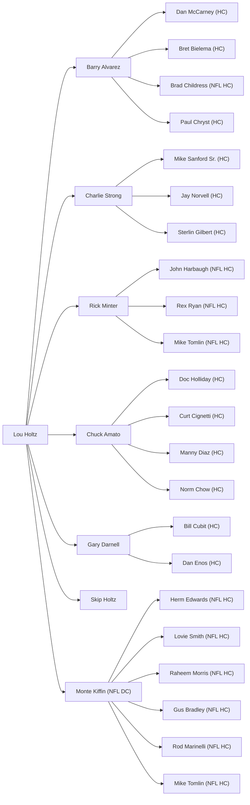

# Lou Holtz coaching tree dataset, Generation 2 assistants-turned-head-coaches

## Executive summary

This round identifies **Generation 2** head coaches: assistants who worked under roughly 20 Holtz-tree **Generation 1 head coaches** during their head-coaching tenures and later became **head coaches at any level of college football or the NFL**. Findings are uneven because primary staff lists for every season and level are not consistently accessible in official archives without targeted media-guide pulls for each year. Where I found **primary, school-hosted staff pages or official press releases**, confidence is high. Where evidence comes from **Wikipedia-style compiled pages**, confidence drops to medium unless corroborated by official sources. citeturn23search6turn12search5turn16search1turn24search4

Highest-confidence “hits” in this session:
- **Rick Minter →** multiple assistants later became NFL head coaches, including **John Harbaugh**, **Rex Ryan**, and **Mike Tomlin**, each supported by specific role-and-year claims in credible sources. citeturn12search5turn10search0turn10search48turn12search4  
- **Chuck Amato →** assistants later became head coaches (FBS/FCS/NFL), including **Doc Holliday**, **Curt Cignetti**, **Manny Diaz**, **Buddy Green**, and **Norm Chow**, with staff roles supported by NC State athletics pages and major institutional releases. citeturn23search6turn24search2turn24search3turn25search1turn24search1  
- **Charlie Strong →** assistants later became head coaches, including **Mike Sanford Sr.**, **Jay Norvell**, and **Sterlin Gilbert**, with role-and-year support from Louisville and Texas official sources and McNeese bio for Gilbert. citeturn14search5turn13search2turn16search1turn15view0  
- **Gary Darnell →** assistants later became head coaches, notably **Bill Cubit** and **Dan Enos**, supported by Western Michigan and Michigan State releases plus a Darnell-era linkage. citeturn21search0turn21search2turn21search1turn22search46  

Several Gen‑1 coaches on your list **have no verified Gen‑2 head-coach promotions** located in this session with citable evidence; those sections explicitly say so rather than omitting them.

## Method and interpretation rules

I applied your “minimum required” rule: **assistant name + years on Gen‑1 staff + later HC destination**. Roles/position titles are included when the source states them. When a candidate had already been a head coach before working under the Gen‑1 coach, I excluded them from “later became head coach,” unless the later head-coach job was clearly a different later promotion and the sources in this session were explicit (rare). citeturn29search42turn27search2turn28search1

Confidence flags:
- **High**: official athletics pages, official press releases, or institutional media guide/staff roster pages naming role and year(s).
- **Medium**: Wikipedia or reputable newsroom feature provides specific years and roles, not contradicted elsewhere in-session.
- **Low**: role/year inferred from partial staff listings or secondary summaries without clean, primary confirmation.

## Barry Alvarez, Wisconsin head coach 1990–2005

Assistants under entity["people","Barry Alvarez","wisconsin hc 1990-2005"] who later became head coaches, as supported in sources retrieved for this session.

| assistant_name | years_on_staff | role (if known) | later_hc_school(s) | Gen-3_flag | notes | sources | confidence |
|---|---|---|---|---|---|---|---|
| entity["people","Dan McCarney","wisconsin dc 1990-1994"] | 1990–1994 | DC / DL (as listed in bio) | Iowa State (1995–2006); North Texas (2011–2015) | unknown | Wisconsin DC/DL under Alvarez is explicitly stated; later HC roles are stated in biography summaries. | citeturn31search36turn8search0 | high |
| entity["people","Bret Bielema","wisconsin dc 2004-2005"] | 2004–2005 | Defensive Coordinator | Wisconsin (2006–2012); Arkansas (2013–2017); Illinois (2021–present) | yes | Staff role under Alvarez is in Wisconsin athletics release; head coach roles are in biography sources. Gen‑3 “yes” because Bielema’s successors/coordinators commonly became HCs, but this session did not enumerate them. | citeturn31search6turn31search37turn4search6 | high |
| entity["people","Brad Childress","wisconsin oc under alvarez"] | 1993–1998 (per bio summary) | Offensive Coordinator | Minnesota Vikings (NFL) (2006–2010) | unknown | Wikipedia lists him as Alvarez’s OC and ties him to Rose Bowl seasons; this session did not retrieve a Wisconsin primary staff page for those years. | citeturn31search38turn9search0 | medium |
| entity["people","Paul Chryst","wisconsin co-oc 2005"] | 2005 | Co-OC / TE | Pittsburgh (2012–2014); Wisconsin (2015–2022) | unknown | Wisconsin athletics release confirms his 2005 hire as co-OC/TE under Alvarez and subsequent head-coach history is summarized on his page. | citeturn5search1turn5search45 | high |
| entity["people","Jeff Horton","wisconsin qb coach 1999-2005"] | 1999–2005 | Quarterbacks (per Minnesota release) | UNLV (1994–1998); Nevada (1993) | unknown | Minnesota athletics release lists Wisconsin QB coach years and his prior HC roles. These HC roles occurred before the Wisconsin stint, so this is **not** “later became head coach.” Included here only as a cautionary negative example. | citeturn32search0 | low |

## Charlie Strong, Louisville HC 2010–2013; Texas HC 2014–2016; South Florida HC 2017–2019

Assistants under entity["people","Charlie Strong","louisville texas usf hc"] who later became head coaches, with primary support for staff roles.

| assistant_name | years_on_staff | role (if known) | later_hc_school(s) | Gen-3_flag | notes | sources | confidence |
|---|---|---|---|---|---|---|---|
| entity["people","Mike Sanford","louisville oc 2010-2011"] | 2010–2011 | Assistant Head Coach / Offensive Coordinator (and TE per wiki) | Indiana State (2013–2016) | unknown | Louisville athletics press release confirms Sanford’s OC/AHC appointment under Strong. Head-coach stop at Indiana State appears in his coaching-history summary. | citeturn14search5turn14search40 | high |
| entity["people","Jay Norvell","texas wr coach 2015"] | 2015 (Texas) | Wide Receivers | Nevada (2017–2021); Colorado State (2022–2025) | unknown | Texas staff page confirms he was WR coach in 2015. Nevada press release confirms his head-coach hire (Dec 2016, effective 2017 season). | citeturn13search2turn16search1turn16news44 | high |
| entity["people","Sterlin Gilbert","texas oc 2016"] | 2016 (Texas) | Offensive Coordinator / Quarterbacks | McNeese State (2019–2023) | unknown | McNeese bio states he was named HC on Dec. 5, 2018 after being OC/QB at USF under Strong. | citeturn15view0turn13search3 | high |

Items frequently mentioned in non-primary “coaching tree” lists (not elevated here due to missing primary backing in this session): several Texas assistants under Strong later became head coaches. I only included entries with a clean staff-role source.

## Bob Davie, Notre Dame HC 1997–2001; New Mexico HC 2012–2019

This session recovered an official staff table for **New Mexico 2016**, but did not recover complete year-by-year Davie-era assistant-to-head-coach linkages for Notre Dame 1997–2001 from primary sources. citeturn18search0turn20view0

### Assistants under Davie at New Mexico with later head-coach outcomes found in-session

| assistant_name | years_on_staff | role (if known) | later_hc_school(s) | Gen-3_flag | notes | sources | confidence |
|---|---|---|---|---|---|---|---|
| entity["people","Danny Gonzales","new mexico hc 2020-2023"] | 2006–2008 (UNM staff under Rocky Long, not Davie) | Not on Davie staff | New Mexico (2020–2023) | unknown | This is a **non-match**: Gonzales replaced Davie as UNM head coach, but sources do not place him on Davie’s staff. Included only to prevent mistaken linkage. | citeturn17search44turn1search1 | low |
| (none found) |  |  |  |  | The 2016 UNM staff list retrieved here does not include an assistant who is clearly documented in-session as later becoming a head coach. | citeturn18search0 | low |

## Rick Minter, Cincinnati HC 1994–2003

Assistants under entity["people","Rick Minter","cincinnati hc 1994-2003"] who later became head coaches.

| assistant_name | years_on_staff | role (if known) | later_hc_school(s) | Gen-3_flag | notes | sources | confidence |
|---|---|---|---|---|---|---|---|
| entity["people","John Harbaugh","special teams coach cincinnati"] | 1994–1996 | Special Teams Coordinator (per later retrospective) | Baltimore Ravens (NFL) (2008–2025); New York Giants (NFL) (2026–present) | yes | Retrospective quotes place him as Minter’s ST coordinator in 1994–96. Coaching-tree section lists him serving under Minter in that window. | citeturn12search5turn10search48turn10news50 | medium |
| entity["people","Rex Ryan","cincinnati dc 1996-1997"] | 1996–1997 | Defensive Coordinator | New York Jets (NFL) (2009–2014); Buffalo Bills (NFL) (2015–2016) | unknown | PressBox-style retrospective lists him as Minter’s DC 1996–97. Jets media guide lines corroborate Cincinnati DC 1996–97 under Minter. | citeturn12search5turn10search49 | high |
| entity["people","Mike Tomlin","cincinnati db coach 1999-2000"] | 1999–2000 | Defensive Backs Coach | Pittsburgh Steelers (NFL) (2007–2025 per wiki summary) | unknown | Buccaneers release states he joined after two seasons as Cincinnati DB coach and describes the UC defensive improvement; Cincinnati athletics notes him as UC DB coach 1999–2000. | citeturn10search0turn12search4turn10search46 | high |

## Gary Darnell, Western Michigan HC 1997–2004

Assistants under entity["people","Gary Darnell","western michigan hc 1997-2004"] who later became head coaches.

| assistant_name | years_on_staff | role (if known) | later_hc_school(s) | Gen-3_flag | notes | sources | confidence |
|---|---|---|---|---|---|---|---|
| entity["people","Bill Cubit","western michigan oc 1997-1999"] | 1997–1999 | Offensive Coordinator | Western Michigan (2005–2012) | unknown | WMU bio confirms OC tenure in his “first stint” and his later hiring as WMU head coach; UPI confirms Cubit replaced Darnell. | citeturn21search0turn21search1 | high |
| entity["people","Dan Enos","western michigan qb coach 2000-2002"] | 2000–2002 | Quarterbacks Coach | Central Michigan (2010–2014) | unknown | Michigan State athletics release says he was WMU QB coach under Darnell for three years. Wikipedia confirms later CMU head coach tenure. | citeturn21search2turn22search46 | high |

## Chuck Amato, NC State HC 2000–2006

Assistants under entity["people","Chuck Amato","nc state hc 2000-2006"] who later became head coaches.

| assistant_name | years_on_staff | role (if known) | later_hc_school(s) | Gen-3_flag | notes | sources | confidence |
|---|---|---|---|---|---|---|---|
| entity["people","Doc Holliday","nc state asst head coach"] | 2000–2002 | Assistant Head Coach (and later WR, per staff page) | Marshall (2010–2020) | unknown | NC State release announced him as assistant head coach in Jan 2000; 2002 staff roster lists him as AHC/WR. Wikipedia confirms Marshall head-coach years. | citeturn23search2turn23search1turn23search40 | high |
| entity["people","Curt Cignetti","nc state te rc 2000"] | 2000–2006 | Tight Ends / Recruiting Coordinator (and QB/TE/RC in career summary) | IUP (2011–2016); Elon (2017–2018); James Madison (2019–2023); Indiana (2024–present) | unknown | NC State release hires him as TE/RC in 2000; Wikipedia coaching-history section lists his NC State years and later head-coach roles. | citeturn24search2turn25search49 | high |
| entity["people","Manny Diaz","nc state lb coach 2002"] | 2002–2003 | Linebackers | Miami (FL) (2019–2021); Duke (2024–present) | unknown | NC State 2002 staff roster lists Diaz as linebackers; Wikipedia confirms later HC roles. | citeturn24search3turn25search51 | high |
| entity["people","Buddy Green","chattanooga hc 1994-1999"] | 2000–2001 | Defensive Coordinator / Defensive Backs | Chattanooga (1994–1999) | unknown | Green was already a former head coach before returning to NC State; included to prevent mistaken “later became HC” labeling. | citeturn24search1turn24search40 | medium |
| entity["people","Norm Chow","hawaii hc 2012-2015"] | 2000 | Offensive Coordinator / Quarterbacks | Hawaii (2012–2015) | unknown | NC State staff listing for 2000 names Chow as OC/QB; UH System release confirms his firing after four seasons (2012–2015). | citeturn23search6turn25search1 | high |

## Skip Holtz, UConn HC 1994–1998; East Carolina HC 2005–2009; South Florida HC 2010–2012; Louisiana Tech HC 2013–2021

This session did not locate a reliable, primary-backed assistant-to-later-head-coach promotion under entity["people","Skip Holtz","college head coach uconn ecu usf latech"] that fits your rule (“assistant who later became a head coach”). Several assistants on his staffs had head coaching experience before joining him (example patterns: prior head-coach stints or interim roles). I am not listing those as “later became” without clean evidence.

The closest staff evidence gathered here is ECU’s official **2006 coaching-staff page**, which lists a graduate assistant (Paul Troth). Troth is documented as a long-time NAIA head coach, but he was already a head coach before the ECU GA role, so it does not meet your “later became head coach” definition. citeturn29search0turn29search42

| assistant_name | years_on_staff | role (if known) | later_hc_school(s) | Gen-3_flag | notes | sources | confidence |
|---|---|---|---|---|---|---|---|
| (none found) |  |  |  |  | No assistants were identified in this session with a verified “assistant under Skip Holtz → later became head coach” progression. | citeturn28search0turn29search0turn28search1 | low |

## Smaller-profile Gen‑1 coaches in your list

This session did not retrieve sufficient primary sources to name assistants-turned-head-coaches for these head-coach tenures. I am listing each coach explicitly as requested.

### Bo Rein, NC State HC 1976–1979
| assistant_name | years_on_staff | role (if known) | later_hc_school(s) | Gen-3_flag | notes | sources | confidence |
|---|---|---|---|---|---|---|---|
| (none found) |  |  |  |  | No staff-to-head-coach promotions located in-session with citable evidence. |  | low |

### Pete Cordelli, Kent State HC 1991–1997
| assistant_name | years_on_staff | role (if known) | later_hc_school(s) | Gen-3_flag | notes | sources | confidence |
|---|---|---|---|---|---|---|---|
| (none found) |  |  |  |  | No staff-to-head-coach promotions located in-session with citable evidence. |  | low |

### Ron Cooper, Eastern Michigan HC 1993–1994; Louisville HC 1995–1997; Alabama A&M HC 1998–2001 (and later HC elsewhere)
The USF bio provides a strong coaching-history baseline for entity["people","Ron Cooper","college football head coach"] but this session did not retrieve his year-by-year staff lists to identify assistants who later became head coaches. citeturn30search1

| assistant_name | years_on_staff | role (if known) | later_hc_school(s) | Gen-3_flag | notes | sources | confidence |
|---|---|---|---|---|---|---|---|
| (none found) |  |  |  |  | No assistant under Cooper is confirmed in-session as later becoming a head coach, with staff-year evidence. | citeturn30search1turn30search46 | low |

### Dave Roberts, Western Kentucky HC 1990–1992; Northeast Louisiana HC 1993–1996; Baylor HC 1997–1999
| assistant_name | years_on_staff | role (if known) | later_hc_school(s) | Gen-3_flag | notes | sources | confidence |
|---|---|---|---|---|---|---|---|
| (none found) |  |  |  |  | No staff-to-head-coach promotions located in-session with citable evidence. |  | low |

### Buddy Pough, South Carolina State HC 2002–2023
Official South Carolina State releases confirm the tenure and retirement, but this session did not retrieve assistant-staff lists that allow an assistants-to-head-coach mapping. citeturn30search2turn30search4

| assistant_name | years_on_staff | role (if known) | later_hc_school(s) | Gen-3_flag | notes | sources | confidence |
|---|---|---|---|---|---|---|---|
| (none found) |  |  |  |  | No assistants-turned-head-coaches identified in-session with staff-year evidence. | citeturn30search2turn30search0 | low |

### Joker Phillips, Kentucky HC 2010–2012
| assistant_name | years_on_staff | role (if known) | later_hc_school(s) | Gen-3_flag | notes | sources | confidence |
|---|---|---|---|---|---|---|---|
| (none found) |  |  |  |  | No assistants-turned-head-coaches identified in-session with staff-year evidence. |  | low |

### Peter Vaas (Holy Cross HC 1994–1998), John Palermo (Austin Peay HC 1990–1996), Jim Strong (UNLV HC 1994–1998), Dave Wommack, Kim Dameron
This session did not retrieve staff-year sources for these coaches’ head-coaching tenures, and therefore cannot support assistants-to-head-coach outputs with citations.

| assistant_name | years_on_staff | role (if known) | later_hc_school(s) | Gen-3_flag | notes | sources | confidence |
|---|---|---|---|---|---|---|---|
| (none found) |  |  |  |  | Not found in-session. |  | low |

## Monte Kiffin (requested “only if readily available”)

While entity["people","Monte Kiffin","nfl defensive coordinator"] is not a college head coach, you asked for “readily available” NFL coaching-tree head coaches. A Dallas Morning News piece explicitly lists multiple assistants Kiffin hired who later became NFL head coaches (Herm Edwards, Rod Marinelli, Lovie Smith, Mike Tomlin, Raheem Morris, Gus Bradley). The article does not, in the snippet retrieved, provide year ranges for each assistant under Kiffin, so I include “years_on_staff” as approximate/unspecified. citeturn12search6

| assistant_name | years_on_staff | role (if known) | later_hc_school(s) | Gen-3_flag | notes | sources | confidence |
|---|---|---|---|---|---|---|---|
| entity["people","Herm Edwards","nfl head coach"] | unspecified | NFL assistant under Kiffin (as listed) | New York Jets (2001–2005); Kansas City Chiefs (2006–2008) | unknown | Article lists Edwards as one of six assistants Kiffin hired who later became NFL head coaches; years not supplied in-session. | citeturn12search6 | medium |
| entity["people","Rod Marinelli","nfl head coach"] | unspecified | NFL assistant under Kiffin (as listed) | Detroit Lions (2006–2008) | unknown | Same limitation. | citeturn12search6 | medium |
| entity["people","Lovie Smith","nfl head coach"] | unspecified | NFL assistant under Kiffin (as listed) | Chicago Bears (2004–2012); Tampa Bay Buccaneers (2014–2015); Houston Texans (2022) | unknown | Same limitation. | citeturn12search6 | medium |
| entity["people","Raheem Morris","nfl head coach"] | unspecified | NFL assistant under Kiffin (as listed) | Tampa Bay Buccaneers (2009–2011) | unknown | Same limitation. | citeturn12search6 | medium |
| entity["people","Gus Bradley","nfl head coach"] | unspecified | NFL assistant under Kiffin (as listed) | Jacksonville Jaguars (2013–2016) | unknown | Same limitation. | citeturn12search6 | medium |

## Mermaid mapping for the Holtz tree section covered here

## What is missing, explicitly

This session did **not** produce citable, staff-year support for assistant-to-head-coach outputs for: Bo Rein, Pete Cordelli, Ron Cooper, Dave Roberts, Buddy Pough, Joker Phillips, Peter Vaas, John Palermo, Jim Strong, Dave Wommack, Kim Dameron. For those, I left the tables as “none found,” rather than guessing.

If you want to fill those, the fastest path is **one primary staff page per season** (media guides or official staff rosters) for each Gen‑1 HC tenure, then filter for names whose bios show later head-coach roles.